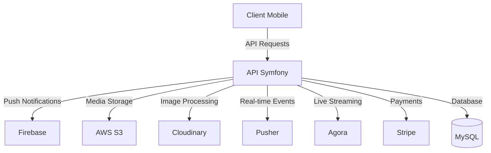

# SwipeLive - Application de Live Shopping

[](https://php.net)
[](https://symfony.com)
[](https://opensource.org/licenses/MIT)

## 📱 À propos

SwipeLive était une application mobile innovante de live shopping, permettant aux vendeurs de présenter leurs produits en direct et aux acheteurs d'interagir et d'acheter en temps réel. 
Le projet combinait l'expérience immersive du streaming en direct avec la simplicité du commerce électronique.

**État du projet :** Application fonctionnelle, levée de fonds signée (250k €), projet arrêté stratégiquement avant l'utilisation des fonds suite à l'arrivée de TikTok Shop en France. 


### Composants du projet :
- **Backend :** API RESTful & WebSocket développée avec Symfony 6.4 ([github.com/juuulienr/swipelive](https://github.com/juuulienr/swipelive))
- **Frontend mobile :** Application développée avec Capacitor et Vue.js 3 ([github.com/juuulienr/swipelive-app](https://github.com/juuulienr/swipelive-app))

## 🚀 Fonctionnalités

- **Live Streaming**
  - Diffusion en direct via Agora
  - Chat en temps réel avec Pusher
  - Interactions vendeur-acheteur en direct

- **Gestion des Produits**
  - Catalogue de produits
  - Gestion des stocks en temps réel
  - Présentation des produits pendant le live

- **Paiements Sécurisés**
  - Intégration Stripe
  - Transactions sécurisées
  - Historique des commandes

- **Authentification et Sécurité**
  - JWT pour l'authentification API
  - Firebase pour l'authentification utilisateur
  - Gestion des rôles (acheteurs, vendeurs, administrateurs)

- **Gestion des Médias**
  - Cloudinary pour la gestion des médias
  - Traitement vidéo avec FFmpeg
  - Stockage AWS S3

## 🛠 Technologies Utilisées

- **Backend**
  - Symfony 6.4
  - PHP 8.2
  - Doctrine ORM
  - JWT Authentication
  - MySQL/MariaDB

- **Services Cloud**
  - AWS S3 pour le stockage
  - Cloudinary pour les médias
  - Firebase pour l'authentification
  - Pusher pour le temps réel
  - Stripe pour les paiements
  - Agora pour le streaming vidéo

- **Monitoring**
  - Bugsnag pour le suivi des erreurs
  - Logs personnalisés

## 📋 Prérequis

- PHP 8.2 ou supérieur
- Composer
- MySQL/MariaDB
- FFmpeg

## 🚀 Installation

1. **Cloner le projet**
   ```bash
   git clone https://github.com/votre-username/swipelive.git
   cd swipelive
   ```

2. **Installer les dépendances**
   ```bash
   composer install
   npm install # ou yarn install
   ```

3. **Configuration de l'environnement**
   ```bash
   cp .env.example .env
   # Configurez les variables d'environnement dans .env
   ```

4. **Configuration de la base de données**
   ```bash
   php bin/console doctrine:database:create
   php bin/console doctrine:migrations:migrate
   ```

5. **Générer les clés JWT**
   ```bash
   mkdir -p config/jwt
   openssl genpkey -out config/jwt/private.pem -aes256 -algorithm rsa -pkeyopt rsa_keygen_bits:4096
   openssl pkey -in config/jwt/private.pem -out config/jwt/public.pem -pubout
   ```

6. **Compiler les assets**
   ```bash
   npm run build # ou yarn build
   ```

7. **Démarrer le serveur**
   ```bash
   symfony server:start
   ```

## ⚙️ Configuration des Services

### Services Requis

1. **Firebase**
   - Créer un projet Firebase
   - Télécharger le fichier de configuration
   - Placer le fichier dans `config/firebase/`

2. **Stripe**
   - Créer un compte Stripe
   - Configurer les clés API dans `.env`

3. **AWS S3**
   - Créer un bucket S3
   - Configurer les credentials AWS

4. **Cloudinary**
   - Créer un compte Cloudinary
   - Configurer l'URL Cloudinary dans `.env`

5. **Pusher**
   - Créer un compte Pusher
   - Configurer les clés dans `.env`

6. **Agora**
   - Créer un compte Agora
   - Configurer l'App ID et le certificat

## 🏗 Architecture



### Structure du Backend
```
src/
├── Controller/     # Contrôleurs API REST
├── Entity/         # Entités Doctrine
├── Service/        # Services métier
├── Repository/     # Repositories Doctrine
└── EventListener/  # Listeners d'événements
```

## 🔄 Améliorations Architecturales Potentielles

Cette section présente les améliorations architecturales qui auraient pu être implémentées avec le recul pour rendre le projet plus robuste, plus performant et maintenable.

### Domain-Driven Design (DDD)
- Implémentation d'une architecture en couches (Layered Architecture)
  ```
  src/
  ├── Domain/          # Entités, Value Objects, Events
  ├── Application/     # Use Cases, Services applicatifs
  ├── Infrastructure/  # Persistence, External Services
  └── Presentation/   # Controllers, DTOs
  ```
- Définition de Bounded Contexts clairs (ex: Streaming, Marketplace, Authentication)
- Utilisation d'Aggregates pour maintenir la cohérence des données
- Implémentation d'Event Sourcing pour le suivi des changements d'état

### Clean Architecture
- Séparation stricte des responsabilités avec le principe des cercles concentriques
- Inversion des dépendances (interfaces dans le domaine)
- Use Cases isolés et testables
- Mappers dédiés entre les couches

### Microservices
Décomposition potentielle en services autonomes :
- Service de Streaming (Agora)
- Service de Paiement (Stripe)
- Service de Gestion des Produits
- Service de Chat
- Service de Notification
- Service d'Authentication

### Améliorations Techniques
- **Tests**
  - Tests unitaires plus exhaustifs
  - Tests d'intégration avec TestContainers
  - Tests de performance avec K6
  - Tests E2E avec Cypress
  - Fixtures plus complètes avec Alice

- **Patterns & Pratiques**
  - Command Query Responsibility Segregation (CQRS)
  - Implementation du pattern Mediator (ex: symfony/messenger)
  - Circuit Breaker pour les appels aux services externes
  - Cache distribué avec Redis
  - File d'attente avec RabbitMQ pour les opérations asynchrones

- **Monitoring & Observabilité**
  - Distributed Tracing avec Jaeger
  - Métriques détaillées avec Prometheus
  - Dashboards Grafana
  - Log aggregation avec ELK Stack

- **CI/CD**
  - Pipeline de déploiement blue/green
  - Tests de sécurité automatisés
  - Quality Gates avec SonarQube
  - Analyse statique du code plus poussée

Ces améliorations démontrent une compréhension approfondie des pratiques modernes de développement et d'architecture logicielle, tout en maintenant un équilibre entre complexité et maintenabilité.

## 📝 License

Ce projet est sous licence MIT - voir le fichier [LICENSE](LICENSE) pour plus de détails.

